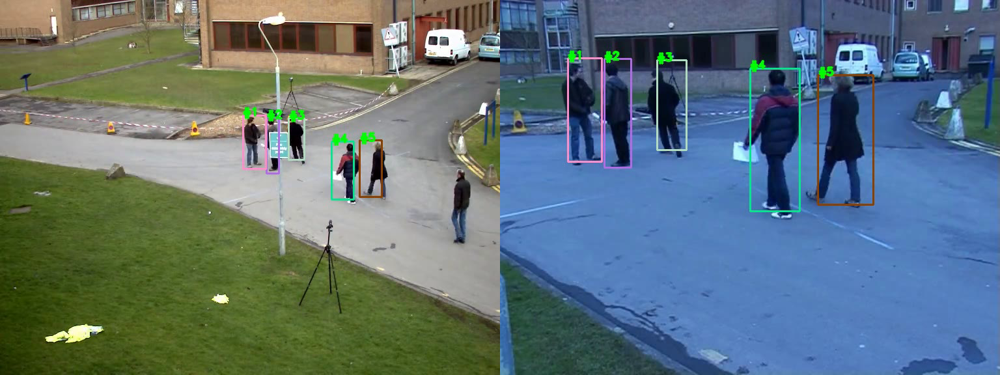

# Multi Camera Tracker (MCTracker)

<p align="center">
<a href="https://www.youtube.com/watch?v=w4sMHanQMIU"  target="_blank"></a>
</p>
<br>

MCTracker is a multi camera tracker based on homography and costs. The costs are computed according to the Mahalanobis distance. Then, a Linear Assignment approach together with a Munkres algorithm have been used for assigning the current detections to the previous tracks. 

# Requirements
* C++14
* OpenCV
* Darknet ([https://github.com/AlexeyAB/darknet](https://github.com/AlexeyAB/darknet))
* Boost
* CUDA (not mandatory)
* Yaml-cpp

# How to build

1. Clone *darknet* repository into the main folder (mctracker).
2. Modify the Makefile in order to use GPU (if any), to use OPENCV, and to build the library:
	- GPU=1, LIBSO=1 and OPENCV=1
3. If necessary, modify the cuda path as well as the architecture (inside the makefile)
4. Inside the darknet folder, go into the forlder include and edit the file yolo_v2_class.hpp
	- Comment Lines 107 and 179 (_#ifdef_ _OPENCV_ and _#endif_)
5. Compile it with: ```make```
6. Download the COCO weights: 
	- [https://pjreddie.com/media/files/yolov3.weights](https://pjreddie.com/media/files/yolov3.weights)
	- Move the downloaded file into the folder *weights*
7. In the main folder *mctracker*, create a folder build
8. navigate into the folder build and compile it with the following commands: ```cmake .. && make```

# How it works

1. To launch the application: ```./multi_camera_tracker ../configs/config.yaml```
2. To create a new homography file: ```./homography_app /path/to/the/source/image /path/to/the/destination/image /path/to/yaml/file (where you save the homography)```

# LICENSE
MIT
